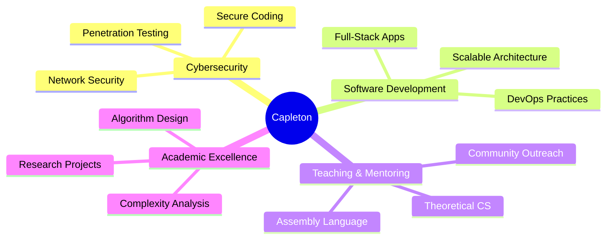

# 

  
  
  
  
  
  
  

---

##  About Me

- **Final-year Computer Science Student** at University of Pretoria  
- **Golden Key Honour Society Member** (Top 15% of students)  
- **Teaching Assistant** for COS210 & COS284  
-  **GPA:** 75%+ | Passionate about **Cybersecurity** & **Software Development**

**What I'm up to:**
-  Leading DevOps for **Save 'n Bite** capstone project (food waste reduction app)
-  Exploring advanced **cybersecurity** concepts and **scalable architecture**
-  Mentoring fellow CS students in theoretical computation

---

##  Tech Arsenal

### **Languages & Frameworks**

### **Frontend Development**

### **Backend & Database**

### **DevOps & Tools**

---

##  Featured Projects

<table>
<tr>
<td width="50%">

### 🍽️ Save 'n Bite (Capstone)
**Food Waste Reduction Platform**

- **Tech:** React, Django, Docker, PostgreSQL, Azure  
- **Role:** DevOps Lead & Full-Stack Developer  
- **Impact:** Connecting food distributors with recipients

</td>
<td width="50%">

### 🗄️ NoSQL Database System
**Custom Database Engine**

- **Tech:** Java, Node.js, REST APIs  
- **Features:** Real-time processing, optimized queries  
- **Focus:** Performance & scalability

</td>
</tr>
<tr>
<td width="50%">

### 🔗 Subscription Sharing App
**Full-Stack Web Application**

- **Tech:** Node.js, MongoDB, React.js  
- **Innovation:** Self-driven development  
- **UI/UX:** Modern, responsive design

</td>
<td width="50%">

###  Community Teaching (JCP)
**Programming & Robotics Education**

- **Impact:** Taught 50+ school children  
- **Mission:** Digital literacy & STEM promotion  
- **Topics:** Basic programming, robotics basics

</td>
</tr>
</table>

---

##  GitHub Analytics

  
  

  

---

##  Current Focus Areas

---

##  Achievements & Recognition

|  Achievement | 📅 Year | 🏛️ Institution |
|---|---|---|
| **Golden Key Honour Society** | 2024 | University of Pretoria |
| **Top 15% Academic Performance** | 2023-2025 | EBIT Faculty, UP |
| **Teaching Assistant (COS210)** | 2025 | Computer Science Dept |
| **Teaching Assistant (COS284)** | 2025 | Computer Science Dept |
| **Community Outreach Leader** | 2024 | JCP Program |

---

##  Professional Experience

###  Computer Science Teaching Assistant
**University of Pretoria** | *Feb 2025 - Present*

- **COS210:** Mentoring students in theoretical computer science (automata theory, complexity analysis)
- **COS284:** Supporting 200+ students in assembly language programming & computer organization
- Conducted interactive sessions on Turing machines, NP-completeness, and algorithmic principles

###  Community Educator
**Joint Community Project (JCP)** | *Jan 2024 - Nov 2024*

- Taught programming fundamentals and robotics to underserved school children
- Promoted digital literacy and STEM career awareness
- Developed age-appropriate curriculum for diverse learning needs

---

##  Let's Connect & Collaborate!

**Open to opportunities in:**
-  **Cybersecurity** roles (SOC analyst, security engineer)
-  **Software Development** (full-stack, backend, DevOps)
-  **Research Collaborations** in computer science
-  **Startup Projects** and innovative tech solutions

---

*"Building secure, scalable systems while empowering the next generation of developers"* 

